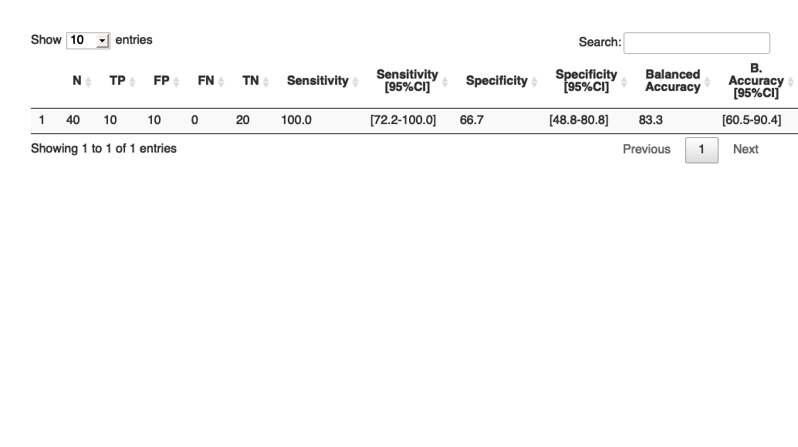
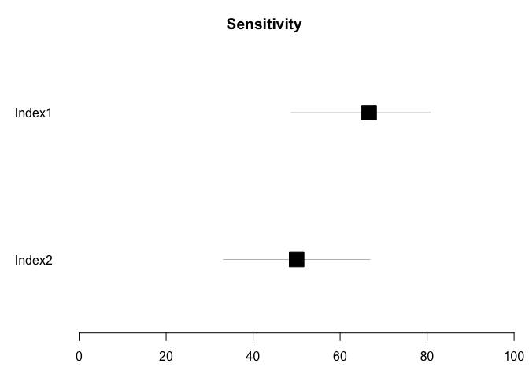

<!-- README.md is generated from README.Rmd. Please edit that file -->

# finddataanalysis

<!-- badges: start -->
<!-- badges: end -->

The goal of finddataanalysis is to …

## Installation

You can install the development version of finddataanalysis from
[GitHub](https://github.com/) with:

``` r
# install.packages("devtools")
devtools::install_github("berkosarFIND/finddataanalysis")
```

## Performance analysis

This is a basic example which shows you how to calculate the sensitivity
and specificity of a diagnostic test.

``` r
library(finddataanalysis)
library(DT)
df <- data.frame(Index = c(rep("Positive", 20), rep("Negative", 20)), Reference = c(rep("Positive", 10), rep("Negative", 30)))
dtable <- sens_spe(data_var = df, index = "Index", ref = "Reference", conf.level = 0.95)
DT::datatable(dtable)
```



Here is a forest plot that you can generate:

    #> Loading required package: grid
    #> Loading required package: magrittr
    #> Loading required package: checkmate
    #> 
    #> Attaching package: 'dplyr'
    #> The following objects are masked from 'package:stats':
    #> 
    #>     filter, lag
    #> The following objects are masked from 'package:base':
    #> 
    #>     intersect, setdiff, setequal, union


