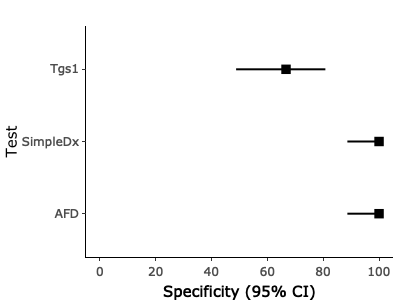
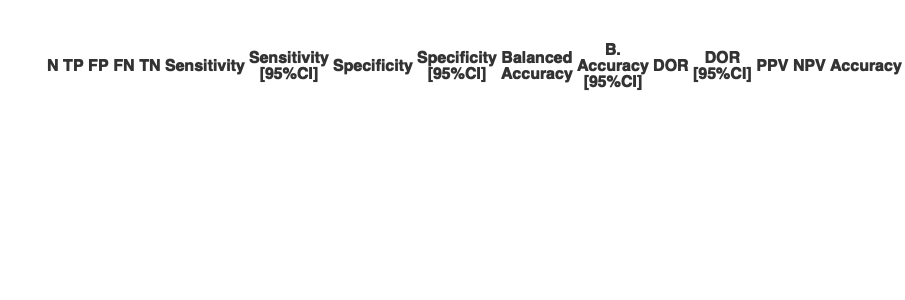

<!-- README.md is generated from README.Rmd. Please edit that file -->

# finddataanalysis

<!-- badges: start -->
<!-- badges: end -->

The goal of finddataanalysis is to have a collection of tools that are
used for data analysis.

## Installation

You can install the development version of finddataanalysis from
[GitHub](https://github.com/) with:

``` r
# install.packages("devtools")
devtools::install_github("finddx/finddataanalysis")
```

## List of functions

List of functions are included in the help. Run the following code in
Console:

    help(package ="finddataanalysis")

## Performance Evaluations

This is a basic example which shows you how to calculate the sensitivity
and specificity of a diagnostic test using the automatized function

``` r
library(finddataanalysis)
#> Warning: replacing previous import 'ggplot2::last_plot' by 'plotly::last_plot'
#> when loading 'finddataanalysis'
#> Warning: replacing previous import 'plotly::rename' by 'plyr::rename' when
#> loading 'finddataanalysis'
library(DT)
df <- data.frame(Index1 = c(rep("Positive", 20), rep("Negative", 20)), Index2 = c(rep("Positive", 5), rep("Negative", 35)), Index3 = c(rep("Positive", 9), rep("Negative", 31)), Reference = c(rep("Positive", 10), rep("Negative", 30)))
```

### Generating All outputs

``` r
eval_output <- performance_eval_auto(data_var = df, list_index = c("Index1", "Index2", "Index3"), ref = "Reference", conf.level = 0.95, index_names = c("Tgs1", "AFD", "SimpleDx"), labels = "Test", forest_plot = TRUE, table_output = TRUE, file_name = "MyEvaluationExample")
eval_output$sen_plot 
```


``` r
eval_output$spe_plot
```



``` r
eval_output$table
```



### Generating Forest Plot Outputs

``` r
eval_output_only_forest <- performance_eval_auto(data_var = df, list_index = c("Index1", "Index2", "Index3"), ref = "Reference", conf.level = 0.95, index_names = c("Tgs1", "AFD", "SimpleDx"), labels = "Test", forest_plot = TRUE, table_output = FALSE)
eval_output_only_forest$sen_plot
```


``` r
eval_output_only_forest$spe_plot
```


``` r
eval_output_only_forest$table  # Should give NULL
#> NULL
```

### Generating a simple data frame output where the table is not formatted, especially considering the confidence intervals. This form is computer friendly.

``` r
eval_output_simple_df <- performance_eval_auto(data_var = df, list_index = c("Index1", "Index2", "Index3"), ref = "Reference", conf.level = 0.95, index_names = c("Tgs1", "AFD", "SimpleDx"), labels = "Test", forest_plot = FALSE, table_output = FALSE)

eval_output_simple_df
#>    N TP FP FN TN Sensitivity Specificity SensLower SensUpper SpeLower SpeUpper
#> 1 40 10 10  0 20         100       66.67     72.25    100.00    48.78    80.77
#> 2 40  5  0  5 30          50      100.00     23.66     76.34    88.65   100.00
#> 3 40  9  0  1 30          90      100.00     59.58     98.21    88.65   100.00
#>   Balanced_Accuracy BAlower BAupper DOR DORUpper DORLower PPV PPVLower PPVUpper
#> 1             83.34   60.52   90.38 Inf      Inf      NaN  50    29.93    70.07
#> 2             75.00   56.15   88.17 Inf      Inf      NaN 100    56.55   100.00
#> 3             95.00   74.11   99.10 Inf      Inf      NaN 100    70.09   100.00
#>      NPV NPVLower NPVUpper Accuracy ACCLower ACCUpper     Test
#> 1 100.00    83.89   100.00     75.0    59.81    85.81     Tgs1
#> 2  85.71    70.62    93.74     87.5    73.89    94.54      AFD
#> 3  96.77    83.81    99.43     97.5    87.12    99.56 SimpleDx
```

### Performance Evaluation by Groups

You can do the subgroup analysis automatically by defining a group
variable (*group_var*). Please note that, this parameter should not be
specified in quotation parks. E.g.: **variable** instead of
**“variable”**

``` r
data(my_dataset)
head(my_dataset)
#>         ID Test_Name   Result  RefTest
#> 1 01STUDID       ABC Negative Negative
#> 2 01STUDID       DST Negative Negative
#> 3 01STUDID       HCG Negative Negative
#> 4 01STUDID      LLJK Negative Negative
#> 5 01STUDID      ddfs Negative Negative
#> 6 01STUDID Weird Lab Negative Negative
eval_output <- performance_eval_auto(data_var = my_dataset, list_index = "Result", ref = "RefTest", conf.level = 0.95, labels = "Test", forest_plot = FALSE, table_output = TRUE, file_name = "MyEvaluationExample", data_long = TRUE, group_var = Test_Name )
```
